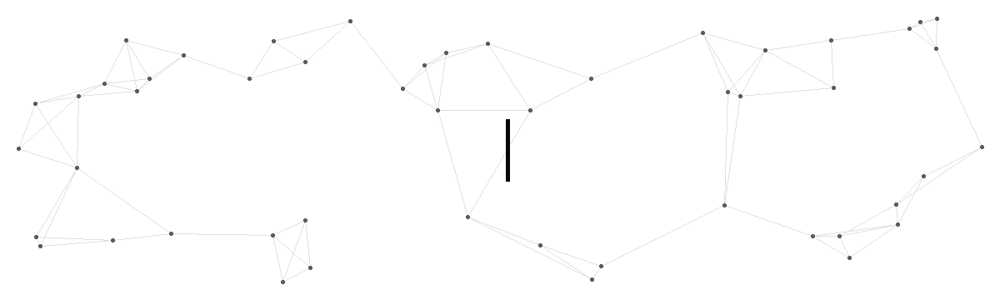

  

<h3>Celyn · AI Products × Learning Systems × Personal Tools</h3>

<i>I don't just explore what AI can do. I turn it into products people can use.</i>

## About Me

- Building **AI-assisted products** for music, learning, and personal publishing.
- Creating **MusiCue FM**, **ContextVocab**, and **Firefly Hub**.
- Working mainly with **TypeScript, Node.js, Python, Next.js, and local-first systems**.
- Interested in **LLM workflows, contextual interfaces, learning systems, and developer tools**.
- I care about turning AI capabilities into products that are practical, understandable, and pleasant to use.
- Writing project notes and experiments at [Celyn's Blog](https://www.celyn-blog.xyz/).

## Tech Stack

**Languages & Web**

  
  
  
  
  

**Runtime & Frameworks**

  
  
  
  
  

**Data & Notebooks**

  
  
  
  

**Developer Tools**

  
  
  
  
  

## GitHub Stats

  
  

  

## Contribution Journey

<picture>
  <source media="(prefers-color-scheme: dark)" srcset="https://raw.githubusercontent.com/HP-Patience/HP-Patience/output/github-contribution-grid-snake-dark.svg?v=1" />
  <source media="(prefers-color-scheme: light)" srcset="https://raw.githubusercontent.com/HP-Patience/HP-Patience/output/github-contribution-grid-snake.svg?v=1" />
  
</picture>

## Activity Overview

  

## Featured Projects

### 01 · MusiCue FM

  

An LLM-powered, local-first music player that turns mood, context, and conversational requests into playback queues and gradual listening arcs.

  
  
  
  
  
  

[Source code](https://github.com/HP-Patience/MusiCue) · [Download v0.1.0](https://github.com/HP-Patience/MusiCue/releases/tag/v0.1.0)

View playback demo

  

### 02 · ContextVocab

  

A context-driven vocabulary workspace that combines continuous stories, AI explanations, and SM-2 spaced repetition for long-term recall.

  
  
  
  

[Live demo](https://englishcontext.vercel.app) · [Source code](https://github.com/HP-Patience/English_Context)

View learning interface

  

### 03 · Firefly Hub

  

A local content and publishing workspace for writing Markdown, previewing articles, managing publication state, and controlling source and build repositories.

  
  
  
  
  

[Source code](https://github.com/HP-Patience/Firefly_Hub) · [Published blog](https://www.celyn-blog.xyz/)

View content dashboard

  

